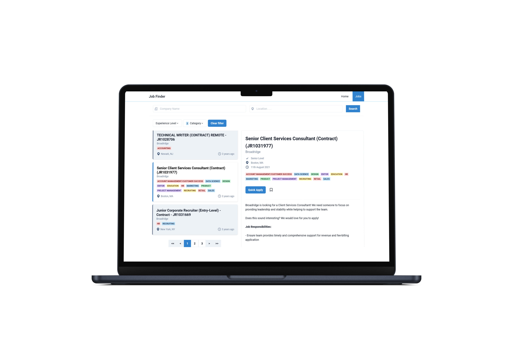

# Job Finder App For Fetching Data from Third-Party API

This project displays a list of data with filtering functionality and provides detailed information for each item. It interacts with a [backend API](https://github.com/Kyaw-Bo-Bo-Aung/job-finder-backend.git) service to fetch and display the data.

## Installation

### Prerequisites
Docker install on your machine.

### Running with Docker
1. Clone the repository:

```bash
git clone https://github.com/Kyaw-Bo-Bo-Aung/job-finder-frontend.git
```

2. Navigate to the project directory:
```bash
cd job-finder-frontend
```  

3. Build the Docker image:
```bash
docker build -t your-frontend-image .
``` 

4. Run the Docker container:
```bash
docker run -d -p 3000:3000 --name your-frontend-container your-frontend-image
```

5. Access the application at http://localhost:3000.
## Usage

#### Features

- Displays a list of jobs.
- Filter and search jobs in job list according to the provided criteria.
- Allows users to view detailed information for each item.
- Provides a responsive user interface for different screen sizes. 




## Configuration

- Copy .env.example and create .env file in the project root folder
```
cp .env.example .env
```

- Backend API URL: Update the REACT_APP_API_BASE_URL in the .env file if the backend server is running on a different host or port.

  
## Tech Stack

React, Context API, [Chakra UI](https://v2.chakra-ui.com/)